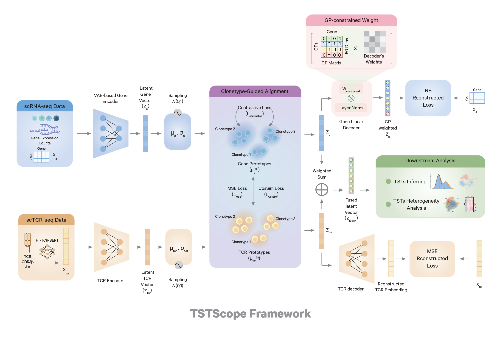

# TSTScope

**TSTScope** is a multimodal deep learning framework that jointly integrates scRNA-seq and scTCR-seq data. TSTScope utilizes a gene program (GP)-constrained variational autoencoder (VAE) to construct an interpretable latent space, effectively unifying antigen specificity with transcriptional states. 

  

## Get Started

To run the demo,

🌟 The processed dataset is available at this .
🌟 The demo notebook is available at this .
